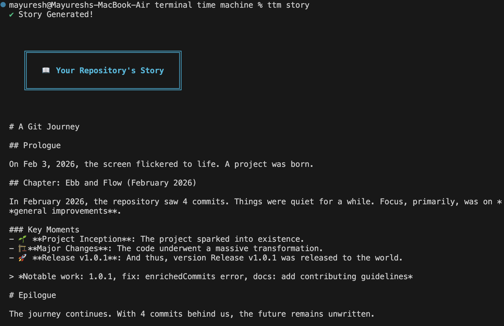

# Terminal Time Machine 🕰️

[](https://opensource.org/licenses/MIT)
[](https://badge.fury.io/js/terminal-time-machine)
[](http://makeapullrequest.com)

**The Open Source CLI for the Software Development Community.**

Transform your Git history into engaging narratives, deep analytical insights, and beautiful visualizations. `ttm` is designed for developers, team leads, and open source maintainers to understand the *story* behind the code.

> **📚 [Read the Full Documentation](docs.md)** — Detailed guide for all commands and configuration.



## 🌟 Why Terminal Time Machine?

In the fast-paced world of software development, we often lose track of the journey. `ttm` brings your repository to life.

- **For Open Source Maintainers**: Automatically generate rich release notes and change logs to keep your community informed.
- **For Developers**: Visualize your "Punch Card" productivity and spot code hotspots before they become technical debt.
- **For Team Leads**: Get a pulse on project health, collaboration patterns, and impact without micromanaging.

## ✨ Key Features

### 📖 Narrative Stories
Turn dry `git log` into readable chapters. our dynamic story engine analyzes commit types, impact scores, and milestones to write a compelling narrative of your project's evolution.
> *Now featuring dynamic mood analysis and contributor spotlights!*

### 🧠 Deep Insights & Analytics
Go beyond simple commit counts. The new `stats` command reveals:
- **🕒 Punch Card**: A visual grid (Day x Hour) showing *when* your team is most productive.
- **🔥 Code Hotspots**: Identify which files are changing the most (churn analysis).
- **💬 Project Vocabulary**: See the most common terms in your commit messages.
- **📊 Rank & Impact**: Visual bar charts for top categories and ranked contributors.

### ⚡ Interactive Timeline
A beautiful ASCII-based visual tree of your commits, branches, and tags, right in your terminal.

### 📝 Automated Release Notes
Generate professional, categorized changelogs instantly. Supports Markdown output for GitHub Releases or rich colored output for terminal reading.

### 🔌 Git Native Extension (New!)
Run TTM commands directly as git subcommands!
- `git story` -> Generates narrative
- `git timeline` -> Visual history
- `git stats` -> Repo statistics
- `git contributors` -> Hall of Fame

### 📦 Dependency Tracking
- **Upgrades Command**: Track when dependencies were updated, added, or removed.
- **Hall of Fame**: A dedicated leaderboard for your project's contributors.

## 🚀 Quick Start

### Installation

**Global (Recommended)**
```bash
npm install -g terminal-time-machine
```

**One-Time Use (npx)**
```bash
npx terminal-time-machine stats
```

### Usage

**1. The "Pulse" Check**
Get a high-level overview of your repo's health and activity.
```bash
ttm stats
```
*Try `ttm stats --theme neon` for a cyberpunk look!*

**2. Tell Me a Story**
Generate a narrative of the last month's work.
```bash
ttm story --since "1 month ago"
```

**3. Visual Timeline**
See the branch history in a clean, ASCII format.
```bash
ttm timeline
```

**4. Interactive Mode**
Not sure what to run? Just type `ttm` to launch the interactive menu.

**5. Git Simulator 🕹️**
Replay your history as if you were typing it again.
```bash
ttm git
```

**6. Git Extension**
Once installed, you can run:
```bash
git story
git timeline
git stats
```

## 🤝 Community & Contributing

We believe in the power of Open Source. **Terminal Time Machine** is built by developers, for developers.

We welcome contributions of all kinds!
- **Found a bug?** Open an issue.
- **Have a feature idea?** Start a discussion.
- **Want to fix something?** PRs are highly encouraged!

Check out our [CONTRIBUTING.md](CONTRIBUTING.md) to get started. We have a friendly code of conduct and a clear guide on how to set up your development environment.

## 📄 License

This project is licensed under the MIT License - see the [LICENSE](LICENSE) file for details.

---

*Made with ❤️ for the Open Source community.*
